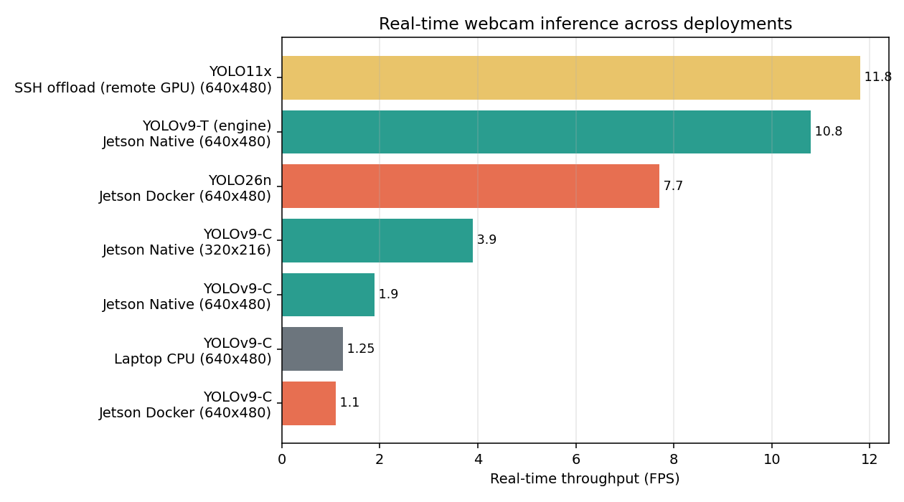
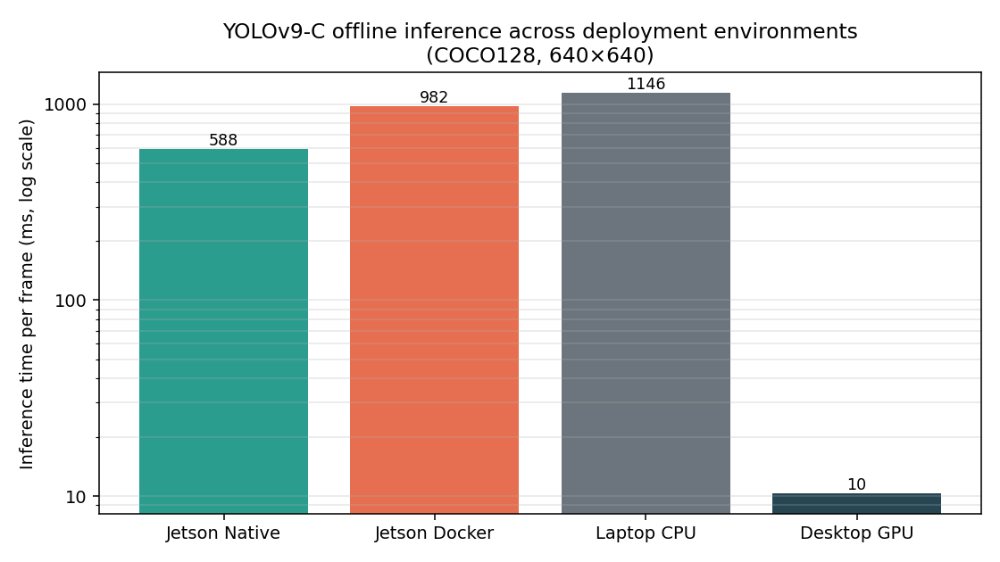
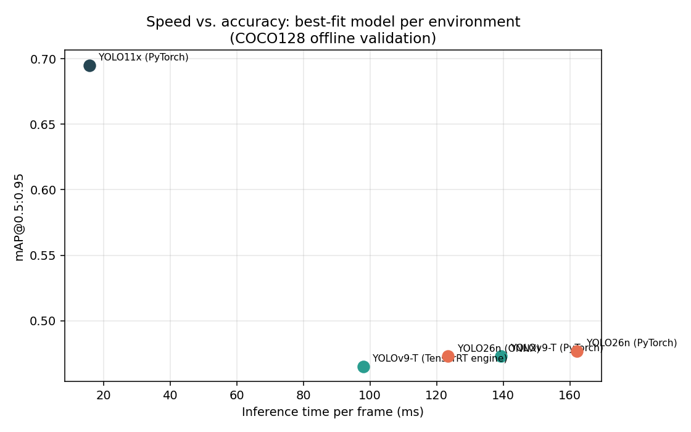

# Object Detection on the NVIDIA Jetson Nano 2GB — a deployment benchmarking study

Getting modern YOLO detectors to run — and run usably — on a $59, 2GB edge device. 
This project takes object detection on the Jetson Nano 2GB end to end: standing 
detectors up across different deployment strategies, optimizing them for the hardware, 
building a remote-GPU offload pipeline for models the Nano can't run alone, 
and benchmarking every configuration.

## What this project covers

1. **Deployment** — running YOLO two ways on JetPack 4.6.1: the quick **Docker**
   route (prebuilt Ultralytics image) and a **native install**, which meant
   resolving JetPack's Python 3.6 / ARM64 dependency chain by hand
   (torch, torchvision, onnxruntime-gpu, protobuf/onnx conflicts, an
   OpenCV-with-CUDA rebuild). See [`docs/setup-guide.md`](docs/setup-guide.md).
2. **On-device optimization** — exporting to a **TensorRT engine**
   (`.pt → ONNX → TensorRT`, with int8/fp16 quantization) to squeeze real-time
   speed out of 128 Maxwell cores, and finding where the 2GB memory ceiling
   stops you.
3. **Remote-GPU offload** — an original **edge/cloud pipeline** where the Nano
   captures and displays while a remote GPU does inference, tunnelled over SSH.
   Code and architecture in [`ssh_pipeline/`](ssh_pipeline/).
4. **Benchmarking** — measuring accuracy and speed for every configuration
   across four environments, offline (COCO128) and in real time (webcam).


## Why this is interesting

Edge inference is all trade-offs: a 2GB Nano has 128 Maxwell CUDA cores and
25.6 GB/s of memory bandwidth, versus 4,608 cores and 448 GB/s on a modern
desktop GPU. The interesting questions aren't "is the desktop faster" (obviously)
but:

- How much **latency does Docker cost** on a memory-constrained edge device?
- How much do you get back from **TensorRT export** and lower resolution?
- Can a **remote-GPU offload** actually beat on-device inference once you account
  for the network round-trip?

## Headline results

### Real-time webcam throughput



The remote-GPU offload (YOLO11x, 57M params, over an SSH tunnel) hit **11.8 FPS**
— edging out the best on-device configuration (YOLOv9-T TensorRT engine at 10.8
FPS) *while running a far more accurate model*. Native YOLOv9-C on the Nano
managed only 1.9 FPS; the same model in Docker dropped to 1.1.

### The Docker overhead is real



Same model, same COCO128 validation, 640×640. Docker's memory overhead shows up
directly as latency on the 2GB device: **982 ms/frame in Docker vs 588 ms
native** — a ~40% inference-time penalty. On the desktop GPU the same model runs
in 10.3 ms.

### Speed vs. accuracy, best-fit model per environment



Each environment was also tested with the model best suited to it — the
lightweight YOLOv9-T on the Nano, the NMS-free YOLO26n in Docker, the heavy
YOLO11x on the desktop. Exporting YOLOv9-T to a **TensorRT engine** cut native
inference from 139 ms to 98 ms at a negligible accuracy cost.

Full numbers: [`benchmarks/`](benchmarks/).

## Deployment environments

| Specification    | Jetson Nano 2GB              | Laptop (CPU only)        | Desktop workstation           |
|------------------|------------------------------|--------------------------|-------------------------------|
| CPU              | Quad-core ARM Cortex-A57     | Intel i7-7500U           | AMD Ryzen 7 7700X             |
| GPU              | Maxwell, 128 CUDA cores      | —                        | RTX 5060 Ti (Blackwell)       |
| RAM              | 2GB LPDDR4 (shared CPU/GPU)  | 16GB DDR4                | 64GB DDR5 + 16GB VRAM         |
| Memory bandwidth | 25.6 GB/s                    | —                        | 448 GB/s                      |
| CUDA             | 10.2 (JetPack 4.6.1)         | —                        | 13.1                          |
| Power draw       | 5–10 W                       | ~15 W                    | 180 W                         |

## What's in here

```
.
├── README.md                    # this file
├── benchmarks/                  # results as CSV + the script that plots them
│   ├── offline_validation_yolov9c.csv    # same model, all environments (COCO128)
│   ├── offline_validation_best_fit.csv   # best-fit model per environment
│   ├── realtime_inference.csv            # webcam FPS results
│   ├── hardware_specs.csv                # the four environments
│   └── plot_benchmarks.py                # regenerates docs/media/*.png
├── ssh_pipeline/                # the remote-GPU offload code (original work)
│   ├── jetson_client.py         # capture → send → receive → draw
│   ├── server_inference.py      # remote GPU: YOLO → detections
│   └── README.md                # architecture diagram + wire protocol
├── docs/
│   ├── setup-guide.md           # JetPack 4.6.1 dependency-resolution guide
│   ├── deployment-comparison.md # Docker vs native vs offload, and why
│   └── media/                   # generated charts
└── cli_workflows/               # the exact commands each benchmark was run with
    ├── native_install.sh        # 13-step native install (the hard part)
    ├── docker_run.sh            # Ultralytics container init + run
    └── validation_detection.md  # YOLOv9-repo CLI for validation & detection
```

Most of the benchmarks were produced by running detectors from the CLI, so the
[`cli_workflows/`](cli_workflows/) directory captures the exact commands rather
than wrapping them in throwaway scripts. The one substantial piece of original
code — the SSH offload pipeline — lives in [`ssh_pipeline/`](ssh_pipeline/).

## Key findings

1. **Docker costs real latency at the edge.** On the 2GB Nano, containerisation
   added ~40% to inference time for the same model — a direct consequence of
   memory overhead on a shared-memory device.
2. **TensorRT export is worth the pain.** Converting to a TensorRT engine gave
   the single biggest on-device speedup, for a negligible accuracy drop — but
   export itself was the hardest step (memory limits meant only the smallest
   model would export on-device).
3. **Offload can beat on-device.** With a private SSH tunnel to a remote GPU, a
   57M-parameter model ran in real time on the Nano — faster *and* more accurate
   than anything the Nano could run itself, at the cost of a network dependency.
4. **The setup is the project.** Getting past JetPack 4.6.1's Python 3.6 / ARM64
   wheel constraints (torch, torchvision, onnxruntime-gpu, protobuf/onnx version
   conflicts) was the bulk of the effort. That work is documented in
   [`docs/setup-guide.md`](docs/setup-guide.md) so the next person doesn't repeat it.

## Reproducing the charts

```bash
pip install pandas matplotlib
python benchmarks/plot_benchmarks.py   # writes docs/media/*.png from the CSVs
```

## License

[MIT](LICENSE)
